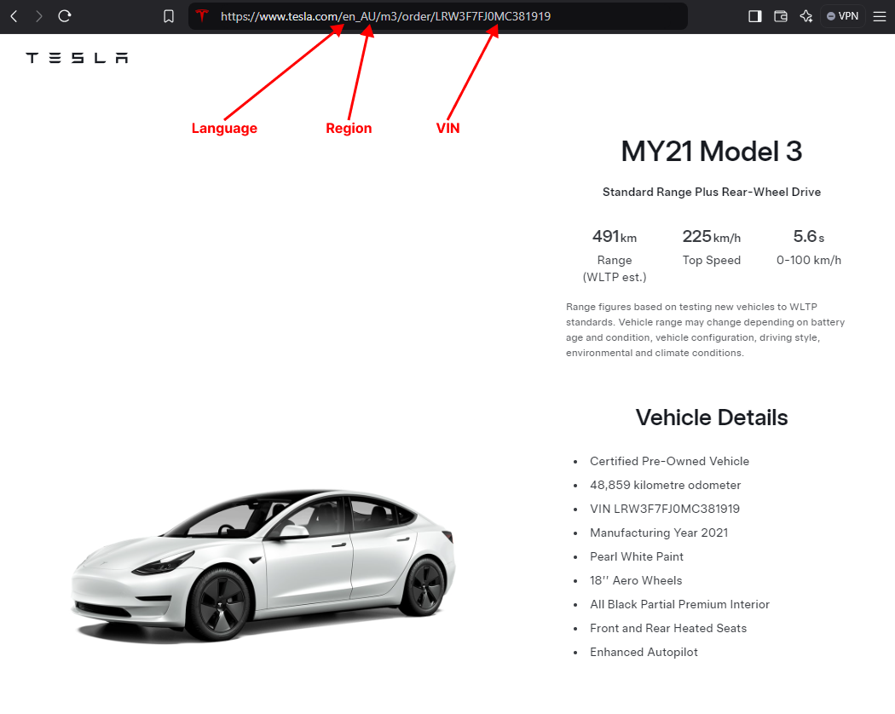

# Home Assistant Add-on: Tesla CPO Inventory Tracker

## One Time Setup & Adding your First Vehicle

1. Go to [tesla.com][tesla] and wait for it to load into your region (let it change into your language, if it needs to).
1. On Tesla's website, navigate to *Vehicles*, then to their *Certified Used Vehicles* inventory. The wording might be different depending on regional differences.
1. Now find a car you wish to track.
1. When you've found a car, open the listing and look at the URL:
    <!-- -  -->
    - Generally, Tesla's URLs are composed in the following format: 
        - `https://www.tesla.com/{LANGUAGE}_{REGION}/{MODEL}/order/{VIN}`
    - You'll need to remember the *Language* and *Region* from the URL prior to starting the add-on.
1. Go to the add-on's configuration and input the values for *Language* and *Region* into their appropriate fields.
1. Lastly, the add-on's configuration field, *Market*, is generally the same value as *Region*. So enter that value there too.
1. Now add your *Postal Code*
1. Now add which *Models* you wish to track; accepted values are:
    - `Model S`
    - `Model 3`
    - `Model X`
    - `Model Y`
    - `Cybertruck`
1. Now add the *VIN(s)* you wish to track. 
    - **Important** - The add-on cannot determine what *Model* a vehicle is based on the VIN, so you must add the vehicle model that corresponds to the VIN. At the time of writing VIN decoding isn't supported by this add-on, but this might be added in a later iteration...
1. Select your *Polling Interval*. The default value is `15` minutes.
1. Add which devices you wish to notify. If it's a mobile device that generally follows the format `mobile_app_{YOUR-DEVICE}`. You can add as many devices as you wish.
1. Lastly, you can enable `Test Notification`. This will send a debug push notification to your devices with the total number of found vehicles for each model. This is helpful to see if everything is configured correctly.
    - For example, if you're tracking a Model S *VIN* of `5YJSA7E21JF000000`, and it finds that item in Tesla's inventory, it'll send you a push notification.
1. Now click *Save* and start the add-on!

### A word of advice
Every time you add a new *VIN*, *Model*, or make a configuration change, you must restart the add-on.

## Support and Logging

This add-on is pretty chatty; it logs a majority of its work in the console. 
- [Please check the *Log* before reaching out][log]

#### Can't figure it out?

- Have a look at the discussions on [GitHub][discuss].
- In case you've found a bug, please [open an issue on GitHub][issue].

[tesla]: https://tesla.com
[url-image]: images/tesla_url_inventory_edited.png
[log]: http://homeassistant.local:8123/hassio/addon/local_tesla_cpo_inventory_tracker/logs
[repo]: https://github.com/mwood77/ha-tesla-inventory-tracker/issues
[discuss]: https://github.com/mwood77/ha-tesla-inventory-tracker/discussions
[issue]: https://github.com/mwood77/ha-tesla-inventory-tracker/issues/new